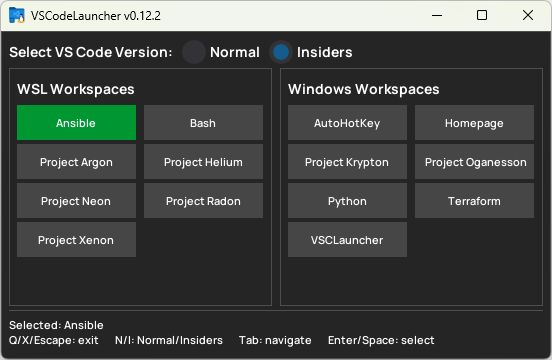

# VS Code Launcher

A simple, keyboard-navigable launcher for VS Code workspaces that supports both
Windows and WSL environments. This tool makes it easy to switch between projects
across different environments, and to choose between standard VS Code and VS
Code Insiders.



## Features

- Clean, two-column display of available VS Code workspaces
- Keyboard navigation with Tab/Shift+Tab
- Launch workspaces with Enter or Space
- Quick exit with Q or X keys
- Automatic workspace detection from a shared directory
- Configurable paths for Windows and WSL workspaces
- Dynamic UI that adjusts to window resizing
- Clear visual feedback for selected items
- Selector for VS Code Insiders or standard VS Code, with the last used
  selection remembered

## Requirements

- Python 3.6+
- Dear PyGui library
- VS Code installed on Windows and/or WSL

## Configuration

The launcher uses a JSON configuration file (`config.json`) to define:

1. Path to VS Code workspaces in Windows
2. Equivalent path to the same workspaces in WSL
3. Command to launch VS Code [Insiders] in each environment

Example configuration:

```json
{
    "windows_workspaces_path": "H:/Development/VS Code workspaces",
    "wsl_workspaces_path": "/mnt/h/Development/VS Code workspaces",
    "launch_options": {
        "wsl_command": "wsl code",
        "windows_command": "code.cmd",
        "wsl_insiders_command": "wsl code-insiders",
        "windows_insiders_command": "code-insiders.cmd"
    }
}
```

## Workspace Naming Convention

The launcher distinguishes between Windows and WSL workspaces based on file
naming:

- Windows workspaces should contain `[Win]` in their filename
- WSL workspaces should contain `[WSL]` in their filename

Example: `MyProject [Win].code-workspace` and `MyProject [WSL].code-workspace`

## Usage

To run the Python script:

1. Copy `config.json.example` to `config.json` and edit to your requirements.
   You will normally only need to amend `windows_workspaces_path` and
   `wsl_workspaces_path`. Any binaries called must be declared explicitly or
   available in your PATH.
   
2. Within Windows, set up the Python virtual environment and install the
   requirements:
   ```pwsh
   python -m venv venv
   & .\venv\Scripts\Activate.ps1
   pip install -r requirements.txt
   ```
   
3. Launch:
   ```pwsh
   python VSCode_launcher.py
   ```

## Keyboard Controls

- **Tab/Shift+Tab**: Navigate between workspace buttons
- **Enter/Space**: Launch the selected workspace
- **Q/X**: Exit the application

## Building the Executable

### Creating the spec file

One time only, we do:

```pwsh
pyi-makespec --onefile --noconsole `
            --add-data "Manrope-Bold.ttf;." `
            --add-data "Manrope-SemiBold.ttf;." `
            --add-data "VSCL.ico;."`
            --icon VSCL.ico `
            VSCode_launcher.py
```

Then we add the following at the end of `VSCode_launcher.spec`, to ensure the
example configuration file is included with the executable (as `config.json`):

```python
import shutil
shutil.copyfile('config.json.example', '{0}/config.json'.format(DISTPATH))
```

### Compiling

To compile the program, run the following command from PowerShell, *within
the virtual environment*:

```pwsh
pyinstaller VSCode_launcher.spec
```

Ensure the `config.json` file is included when distributing the executable and
edit as required prior to use.


## Troubleshooting

If the launcher doesn't work as expected, check:

1. The `config.json` file is correctly configured with valid paths
2. VS Code is installed and available in the PATH (or specified in the config)
3. The workspace files follow the expected naming convention
4. The log file `vscode_launcher.log` in the application directory for errors

## Contributing

Contributions are welcome! Please feel free to submit a Pull Request.

## TODO

Someday/maybe:

- Command-line arguments: Allow users to specify config file location or
  workspace directory via command line
- Theme customisation: Allow users to customise colours via the config file or
  otherwise
- Recent workspaces/favourites: Keep track of recently used workspaces or
  favourites for quicker access
- Workspace search: Add a search function for users with many workspaces
- Automatic workspace detection: Detect if a workspace is WSL or Windows based
  on content rather than filename

## Fonts

This program includes Manrope, an open-source font. Please refer to the
[OFD licence](OFD.txt) for usage.
